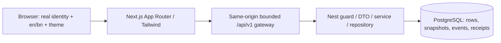
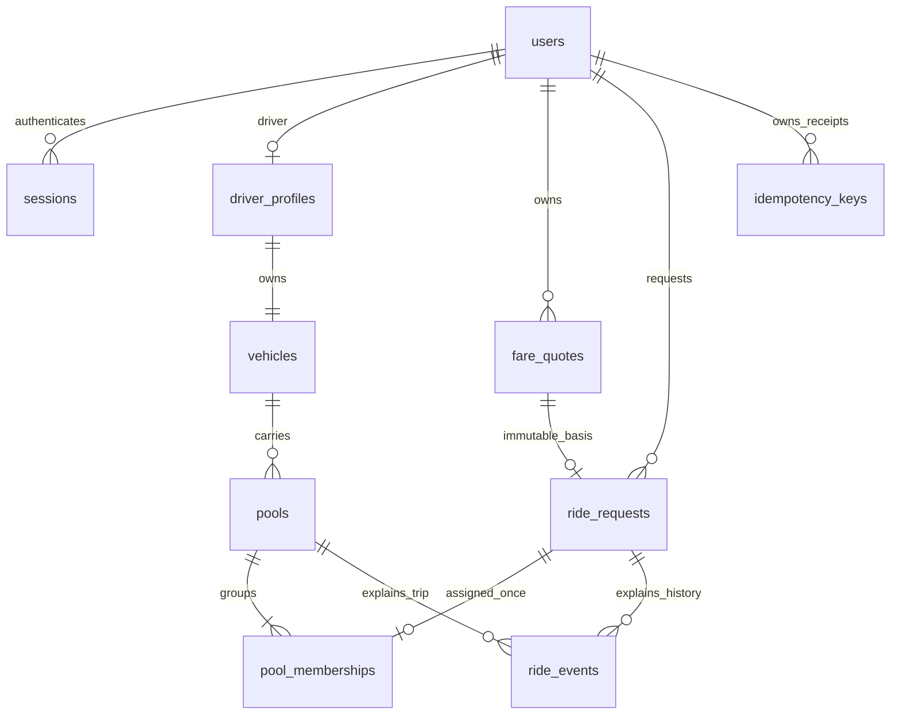

# Dhaka Tesla Pool

A working ride-pooling MVP for Jashim and his three-passenger-seat battery rickshaw **Bullet**, with Nusrat, Rafiq and Shirin. Passengers request seats and see their own fare/status; Jashim accepts compatible routes and controls one shared trip. PostgreSQL retains assignments, final fare facts, terminal history and command receipts.

**Video: DEFERRED_BY_USER.** The original required maximum-six-minute submission row remains open; no script, recording or upload was created. Application delivery and human assessment are separate.

Implemented: real signup/login/logout and server ownership; owned quotes and seat requests; driver online/offline, relevance, atomic acceptance and capacity; arrival/start/complete/cancellation; stable terminal detail and filtered history; real completed-record graphs, cards and exact tables; complete English/Bangla interface; dark/light; mobile/desktop selected Bullet design; safe command recovery and state-preserving locale/theme switches. No client-selected identity, fake graph data, payment gateway, live routing or invented ETA.

## Run

From the directory containing this README, package.json and compose.yaml:

```powershell
# Fresh checkout only: retain any existing private .env.
if (!(Test-Path -LiteralPath .env)) { Copy-Item -LiteralPath .env.example -Destination .env }
# Edit .env: generate POSTGRES_PASSWORD and choose DEMO_PASSWORD (12–128 characters).
docker compose --env-file .env up --build --wait
docker compose --env-file .env --profile demo run --rm seed
```

Open **http://127.0.0.1:3000/en/sign-in** or **http://127.0.0.1:3000/bn/sign-in**. Jashim: `jashim@demo.dhaka.test`; passengers: `nusrat@demo.dhaka.test`, `rafiq@demo.dhaka.test`, `shirin@demo.dhaka.test`. Their password is **your chosen private DEMO_PASSWORD from the initial seed**. Use separate browser contexts for different actors. Signup creates a real passenger account; driver accounts/vehicles are provisioned by the seed. Repeated seed preserves existing passwords, records and timestamps.

Docker Engine/Compose v2 are prerequisites for this path. API/database ports remain private; only loopback web 3000 is published. **Tested Docker fallback** fulfills PDF §6 when no free public backend is available. No hosted deployment URL or paid infrastructure is claimed. [Actual CI runs](https://github.com/asadbinjafor/Dhaka_Tesla_Pool/actions), [operating instructions, native Windows setup, env fields, migration/seed/run/tests and troubleshooting](docs/OPERATIONS.md).

For this already prepared native workspace, retain its .env and isolated PostgreSQL data. Node **24.17.x**, pnpm **12.6.0**, PostgreSQL **18.x**:

```powershell
pnpm install --frozen-lockfile
pnpm build
node --env-file=.env apps/api/dist/database/migrate.js
# Terminal 1:
node --env-file=.env apps/api/dist/main.js
# Terminal 2:
node --env-file=.env apps/web/node_modules/next/dist/bin/next start apps/web --hostname 127.0.0.1
```

Native `.env` needs DATABASE_URL, exact APP_ORIGIN, API_HOST/API_PORT and API_INTERNAL_ORIGIN; the prepared workspace uses loopback PostgreSQL port 15432. Details and optional explicit seed are in OPERATIONS. `docker compose down` retains records; do not delete persistent volumes to fix a problem. Existing applied migrations and application data are preserved.

## Actual screenshots

Current authenticated product screenshots and their exact CI provenance are listed in [screenshot evidence](evidence/screenshots/README.md). They show the selected sidebar/Bullet design, both themes, Bangla typography, mobile layout and real data-backed activity. Historical reference/foundation screenshots are identified separately and are not final-product proof.

## Architecture and database





[Full implemented architecture and debugging explanation](docs/IMPLEMENTED_ARCHITECTURE.md), [actual ERD/constraints/indexes](docs/ERD.md), [implemented API](docs/IMPLEMENTED_API.md). Source authority: `database/migrations/001_initial.sql`, never rewritten after application. Relations enforce driver/vehicle and quote/passenger pairing; partial unique indexes enforce one active resource. Fare/terminal snapshots are immutable. Capacity is a cross-row invariant enforced by coordinated transaction locks, not a misleading row CHECK.

```text
apps/web              Next pages, shared providers, bilingual catalogs, Tailwind, gateway
apps/api              Nest auth/guards/DTOs/services, transaction repositories, safe errors
packages/contracts    Canonical types, presentation route/state helpers
database/migrations   Numbered SQL; checksum/advisory-lock runner
 tests/unit           Catalog/format/transport/presentation checks
 tests/integration    Actual PostgreSQL/Nest HTTP, contention, rollback/replay
 tests/e2e            Real production gateway/browser journeys and UI/a11y evidence
docs / evidence       Requirements, decisions, audits, operating proof and screenshots
compose.yaml          Private DB/API, migration dependency, explicit story seed, persistent volume
```

## Rules that can be checked by hand

Demo geography is Banani pickup to Mohakhali (2 km), Gulshan 1 (3 km) or Gulshan 2 (4 km), same BANANI_V1 compatibility group. Routes/distances are invented and consistently applied, not real routing. Fare per booking is `(৳20 base + ৳10 × demo km − ৳10 pooled discount) × requested seats`. Discount requires at least **two distinct active bookings**; one booking for two seats stays solo. Money is integer poysha, avoiding floating-point currency drift.

Nusrat one seat to Mohakhali costs ৳40 solo / ৳30 pooled. Rafiq two seats to Gulshan 1 costs ৳100 solo / ৳80 pooled; together they consume all three seats. In the last-seat contention test Rafiq reserves two, then Nusrat/Shirin compete; only one wins. Waiting requests reserve zero. Estimates can change before arrival and cannot exceed the quoted solo maximum. Arrival freezes fares and closes new joins/passenger cancellation. Driver cancellation before start has zero charge and preserves any earlier final facts. Cash is the selected payment scope; collection is NOT_TRACKED, never a paid/refunded claim. [Adopted assumptions and decision history](docs/DECISION_LOG.md).

A request is REQUESTED → MATCHED → DRIVER_ARRIVED → STARTED → COMPLETED, with valid cancellation paths. Its pool is ACCEPTED → DRIVER_ARRIVED → STARTED → COMPLETED. Own stable IDs remain readable after `/current` becomes null. Owner-bound five-minute quotes, immutable price basis, one actor/action/key receipt and transactional parent locks make retries and races explainable. [Concurrency implementation and tests](docs/IMPLEMENTED_ARCHITECTURE.md).

## Choices, alternatives and change triggers

The selected Next/Nest/Tailwind/PostgreSQL stack is required by the user. Additional choices:

| Choice | Why it fits this pooling MVP | Alternative / change trigger |
|---|---|---|
| Parameterized pg + numbered SQL | Explicit parent locks, post-wait occupancy, one-client atomic receipts; inspectable relational constraints | Prisma/TypeORM if mapping overhead grows, retaining exact transaction semantics |
| Opaque DB sessions + Argon2id + csrf-sync | Immediate logout/revocation, durable ownership, password hashing and same-origin unsafe-command protection | JWT/OIDC when federated/mobile identity is needed; preserve revocation/ownership |
| REST + Nest class-validator DTOs | Small resource/command surface with strict types and safe stable errors | GraphQL for proven client query needs; Zod if shared validation benefits justify migration |
| Typed en/bn JSON catalogs | Two fixed languages, canonical values and root state persistence | next-intl/ICU if plural rules or locale count outgrow catalogs |
| Tailwind semantic tokens + supplied Bullet art | User-required styling with consistent selected dark/light identity | Extend the current design system when more components warrant it |
| Node test runner + Playwright + axe | Actual SQL/HTTP lock waits and separate browser actors; layout/data/keyboard assertions | Vitest/Jest for richer unit needs; manual accessibility review remains complementary |
| pnpm pinned workspace | Reproducible one-lockfile app/contracts workspace and known native build approvals | npm workspaces if workspace/tool needs change; no mixed lockfiles |
| Self-hosted Noto Sans Bengali | Reliable Bangla glyphs without third-party font requests | Another locally licensed font after verified glyph/layout review |
| Docker + free GitHub CI | Reproducible DB/migration/API/web and independently executed Linux runtime proof without paid hosting | Free managed host when account/resources are available; actual deployment/TLS must be verified |

[Exact dependency pins, compatibility trade-offs and dated audit](docs/DEPENDENCIES.md), [artwork/font/license provenance](docs/THIRD_PARTY_ASSETS.md). ESLint 9 is a deprecated maintenance version retained for the current Next-plugin peer range; upgrading to 10 previously failed peer support. The dated dependency audit reported zero vulnerabilities; review new advisories rather than treating this as a permanent guarantee.

## Tests, evidence and process

```powershell
pnpm build
pnpm typecheck
pnpm lint
pnpm test:unit
# Against a separate isolated PostgreSQL fixture base, as documented:
node --env-file=.env --test --test-concurrency=1 tests/integration/health.test.mjs tests/integration/database.test.mjs tests/integration/auth.test.mjs tests/integration/requests.test.mjs tests/integration/allocation.test.mjs tests/integration/lifecycle.test.mjs tests/integration/statistics.test.mjs tests/integration/hardening.test.mjs
# Running production app, isolated fixture for E2E:
pnpm test:smoke
pnpm test:e2e
```

CI installs the pinned dependencies, builds, typechecks/lints, executes native real-DB suites, starts production containers and executes browser tests. Tests prove both last-seat winner orderings under actual PostgreSQL contention across two API instances, rollback/unknown-COMMIT recovery, ownership/CSRF/session boundaries, lifecycle cutoffs, immutable fares, cancellation, precise history pagination and completed-only Dhaka-day SQL aggregates. Four theme/language combinations and 300 principal-screen/width views include overflow, keyboard, fonts, screenshots and configured axe checks. This is no WCAG certification or production load benchmark. [Final audit](docs/FINAL_AUDIT.md), [PDF matrix](docs/PDF_REQUIREMENT_MATRIX.md), [separate user extras](docs/EXTRA_REQUIREMENT_MATRIX.md), [actual progress/history](docs/TASK_BOARD.md). Review actual PASS/FAIL/BLOCKED/NOT_RUN evidence, not test-file presence.

Contemporary logical feature commits integrate into **master → pre-release → release/v1.0.0**. [Public repository](https://github.com/asadbinjafor/Dhaka_Tesla_Pool), [workflow evidence](GITHUB_REPOSITORY.md). No force-push, history reconstruction, secret/private PDF publication or reference changes. The initial [five-page source/UI audit](docs/INITIAL_AUDIT.md) preceded application changes; earlier starter statuses remain historical and are superseded by the dated final audit.

## Limitations and improvements

Configured demo zones, cash-only collection, three passenger seats, seeded drivers, 2.5-second polling, bounded history/date ranges and local basic rate limiting are deliberate documented assumptions. Refresh loses unfinished in-memory drafts/command intent; stable owned completed/current data persist. Next improvements: privacy-preserving durable recovery after full tab loss, production TLS/abuse controls/session cleanup, backup/observability operations, slimmer production images, optional real-time updates and additional route policies. No live GPS/maps, payment gateway, rating, queue or Kubernetes is required. [Optional scale reasoning](docs/SCALING.md) makes no 1M-user benchmark claim.

AI assistance: **Codex/ChatGPT** helped read/audit sources, implement selected-stack services/UI, draft docs and write/run tests. Accepted: shared database parent locks and root presentation state preserve capacity and user intent. Changed/rejected: a latest-only compiler/linter upgrade failed real peer compatibility; SQL date aliases and premature browser DOM assertions were corrected after actual failures. [Factual AI usage and changes](docs/AI_USAGE_LOG.md). Human ability to explain/debug/change live is **NOT_RUN** and cannot be certified by automation; architecture/debug notes support preparation.

**Required video submission: DEFERRED_BY_USER (P38/U11), no link yet.** All video work stays deferred until separately requested. Original handoff files and source references are retained locally; the private original PDF/reference runtime is intentionally not published or included in containers.
