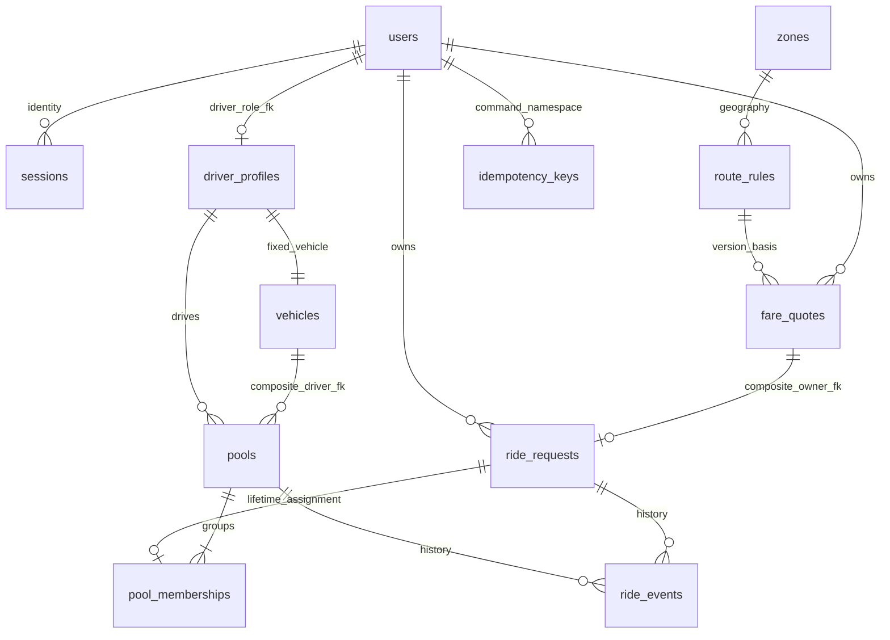

# Implemented relational model

Source of truth: database/migrations/001_initial.sql. Integer poysha, timestamptz,
version-bound JSON fare facts, immutable terminal records. Capacity is three passengers;
driver is separate. Occupancy requires coordinated transactional parent locks, not
an invalid cross-row CHECK. No duplicate history or payment ledger.

Indexes match active resources, dispatch by group/pickup/creation, owned terminal
ended_at+ID keyset, roster, aggregate events, sessions/quotes expiry. CHECK/FK/unique
constraints reject invalid owner pairs, driver roles, quantities, lifecycle terminal
timestamps and unlinked events. Immutable triggers protect quotes, booking facts,
vehicle capacity/owner and finalized/terminal evidence. Application services enforce
cross-row state/capacity, copy consistency and event associations under one client.
