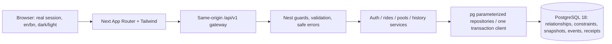

# Implemented architecture and engineering explanation

The initial proposed architecture preceded implementation. This document describes the actual code; [ERD](ERD.md) reflects applied database/migrations/001_initial.sql.

Next is the UI/transport, never fare/role/capacity authority. The gateway uses a fixed API origin, bounded bodies/timeouts, credential/CSRF/idempotency forwarding and multiple Set-Cookie preservation; forged user/role/forwarding headers cannot establish identity. Nest's Express adapter serves one business API; no independent Express application exists. Server session user/role and durable resource ownership precede response/replay. Controllers/DTOs stay thin; services own policy, repositories own parameterized SQL, one pg client owns each business transaction.

## Explain the critical transaction

On acceptance, a driver locks driver_profile then vehicle, finds/locks the active pool, locks the request and counts occupancy **in a later statement after waiting for parent locks** under READ COMMITTED. An earlier single statement count could observe a snapshot from before the lock wait and overbook. Both API instances contend on the same database parent, not an in-memory mutex. Requests reserve nothing before acceptance. Only three active passenger seats can be accepted; quantity is seats consumed, not passenger count. The losing last-seat request remains REQUESTED. Partial uniqueness additionally enforces one active passenger request/driver pool/vehicle pool and one lifetime assignment. Cross-row SUM capacity is enforced by this coordinated write path, not an impossible cross-row CHECK.

Arrival locks the same parents/pool and sorted active requests, closes joining and passenger cancellation, computes every final fare from one current roster and commits state/snapshots/events/receipt atomically. Start and complete require exact predecessor states. Driver cancellation before start leaves zero charge and inspectable prior final evidence. Earlier canceled rows/events are excluded and never rewritten. Unassigned cancellation that discovers a just-committed assignment rolls back the whole first attempt and retries driver-first, avoiding reversed lock order.

Command namespace is actor/action/key UUID plus canonical target/body SHA256. Successful minimal receipts commit with the effect. Same original key replays after expiry/terminal transitions, after ownership/auth checks but before fresh-state guards. A changed payload/target conflicts; a fresh key on an invalid state conflicts. Failed transactions roll back intent and writes. Lost COMMIT acknowledgement returns COMMAND_OUTCOME_UNKNOWN, discards the ambiguous connection and reconciles the same key. Known transient serialization/deadlock failures have bounded retries; unknown outcomes never invent a new key.

Reads use one read-only REPEATABLE READ transaction for coherent DTO/roster/fare. Passenger DTOs allow only own fare/status and safe aggregate occupancy plus assigned driver; other passenger identities/fares/events never appear. Stable terminal IDs and retained membership/events explain history. Full-precision ended_at+UUID keyset cursors bind actor/filter; owned completed SQL aggregates use Asia/Dhaka civil-day bounds. Driver capacity sums each completed pool once before aggregation, not once per member. Cancellation contributes no completed metrics. Graphs/cards/table share actual returned data.

## Explain presentation and authentication

Opaque 256-bit session tokens are stored as SHA256 hashes with eight-hour expiry, rotated at login, deleted on logout; passwords use Argon2id. HttpOnly/Lax/Secure-when-HTTPS cookies and server session-bound CSRF with exact Origin protect unsafe commands. Public registration can only create passengers; driver/vehicle ownership is seeded relationally. Basic local login throttles are bounded per API instance; a multi-instance deployment needs shared abuse limiting (current capacity correctness already works across instances).

The root View/Session/PrivateUI providers sit above locale routes. Locale/theme change display preferences, not identity or numeric/domain values. Valid draft, quote, stable route ID and exact command key/body stay in memory; credentials and private rides are never written to browser storage. Query freshness includes pool representation version because another member changes fare without changing this passenger's request version. Generation/abort and keyed private remount block prior-user responses after logout/account change; the same verified user can reconcile a pending command after reauthentication. A browser reload deliberately loses in-memory unfinished drafts/intent: persistent retry after full tab loss is a documented future improvement, not falsely claimed.

## How to debug and change safely

For a capacity conflict, correlate safe requestId/code with the relevant owned stable ID, inspect parent lock order and active member seat sum, then reproduce with allocation.test.mjs against an isolated DB. For wrong fare, compare immutable booking_snapshot, distinct active booking count at arrival and final_fare_snapshot; don't change historical catalog snapshots. For duplicate actions, inspect actor/action/key receipt and target/body binding; preserve the original intent on unknown outcomes. For an old UI fare, compare both request and pool versions, account generation and current route scope. For statistics, verify completed-only population, Dhaka half-open UTC bounds and per-pool denominator before changing charts.

New schema changes get a **new numbered migration**, never edits to applied files. New lifecycle transitions require same parent locks, guards, ownership, event/receipt atomicity, both catalog keys and real transition/race tests. New route/rate policy needs versioned immutable quote basis and a documented product decision. No direct database reset or public debugging hook is part of these flows. This explanation is preparation material; it cannot certify the author's live interview understanding.
