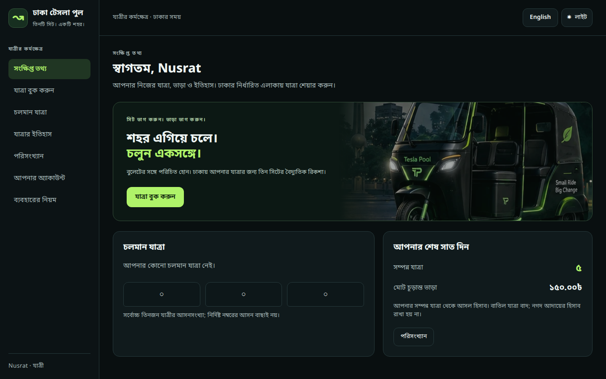
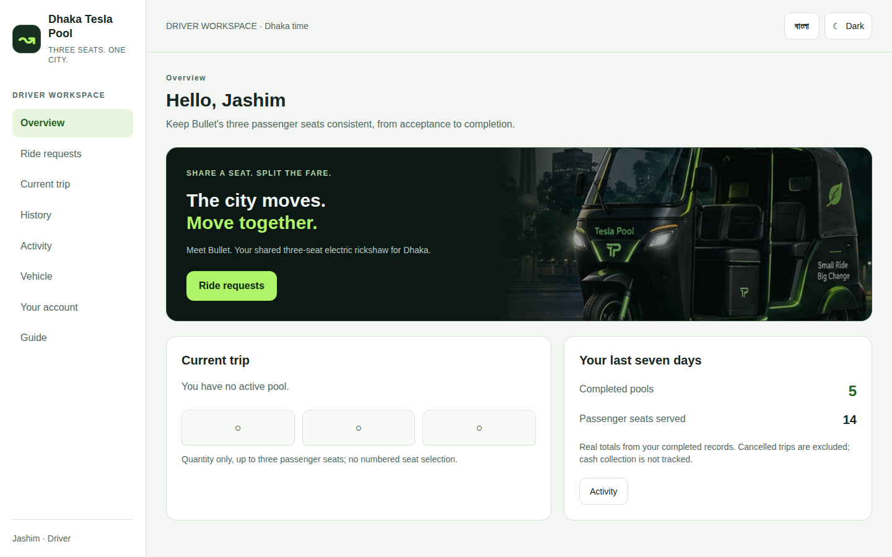
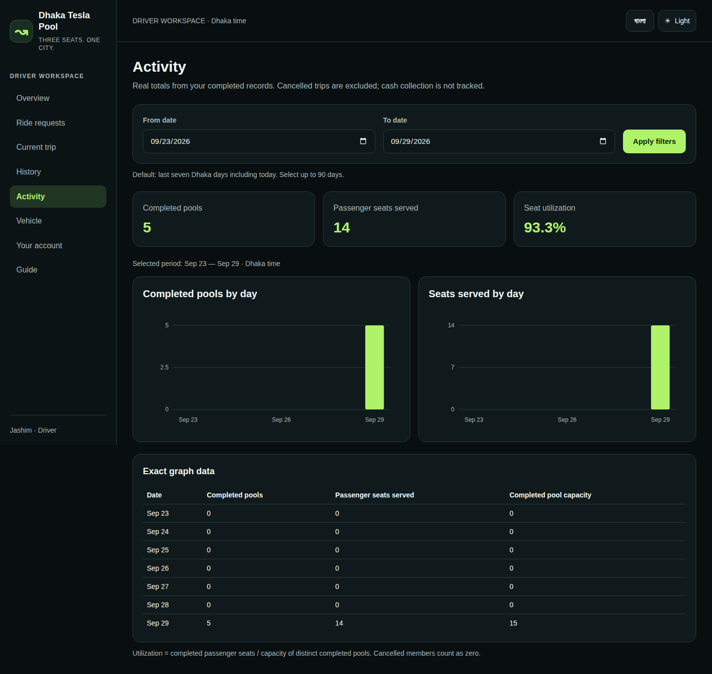
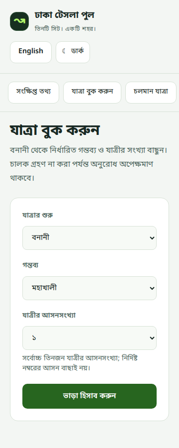

# Actual authenticated product screenshots

Captured by real Chromium/Playwright against production Docker Next/Nest/PostgreSQL, CI [36538087317](https://github.com/asadbinjafor/Dhaka_Tesla_Pool/actions/runs/36538087317), commit 8ff59d89fed9fc94df59d455354e7855496711ae. Seventeen original PNG attachments are copied unchanged; exact source attachment, locale/theme/actor and SHA256 are in provenance.json. The CI HTML artifact contains all300 screen/width screenshots; view-matrix.json contains actual300 measurements (zero outer overflow and zero configured axe violations). Video/trace off.

Representative overview, graph/table and mobile form:

Other images show each actor's remaining locale/theme combinations, Bangla driver mobile requests and passenger activity, fixed 360px Bangla chart labels (actual minimum14px across the matrix), and active Nusrat/Rafiq pooled fares in all four modes. These contain isolated fictional seed/test data, not a screenshot of private local user records. Earlier foundation/reference screenshots are separate historical evidence.

Visual review: supplied charcoal/lime Bullet rickshaw/sidebar identity retained; light surfaces and dark artwork remain distinct with readable foregrounds; Bengali glyphs/conjuncts and translated labels render; 360px form and390px driver actions stay in viewport; graph totals/table agree with real API test fixtures. Configured axe reported no violations but some color-contrast nodes were marked incomplete (e.g. image-backed hero); screenshot/CSS review supplements this, without claiming exhaustive WCAG conformance or review of every automated screenshot by a human.
